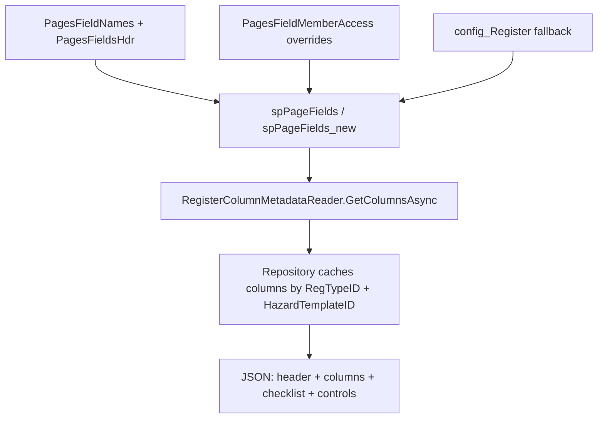

# Page Field Names — How It Works

This document explains how **page field names** (the dynamic, per‑register column
metadata) are implemented across the database and the Agtech MCP server.

The goal of the feature is simple: instead of hard‑coding column headings and
field behaviour in the app, each register/page describes its own fields in data.
A stored procedure resolves the correct field set for a given page, register type
and user, and the MCP server reads that metadata to label and shape the JSON it
returns.

---

## 1. Where the metadata lives

The field definitions live in the `Agtech_UserMgmt` database.

| Table | Purpose |
| --- | --- |
| `PagesFieldsHdr` | Header record per page/register. Maps `PageID` + `RegTypeID` (or `ProcessTypeID`) to a `PagesFieldHdrID`. Flagged with `IsPageFieldAccess`. |
| `PagesFieldNames` | The actual field rows — one per control on a page. This is the "page field names" table. |
| `PagesFieldMemberAccess` | Per‑member overrides (caption, visibility, required, error message) keyed by `UCPageID` + `MemberID` + `PagesFieldHdrID` (+ optional `RefKey`). |
| `config_Register` | Legacy/fallback field source used when no `PagesFieldNames` rows exist. |

### Key columns in `PagesFieldNames`

A representative sample is exported in [PageFieldNames.csv](PageFieldNames.csv).
The meaningful columns are:

| Column | Meaning |
| --- | --- |
| `PageFieldID` | Primary key of the field row. |
| `UCPageID` | The user‑control / sub‑page the field belongs to (e.g. `5333`, `5334`). |
| `PagesFieldHdrID` | Links the field back to its header record. |
| `FieldControlID` | The physical control id in the app (e.g. `wcCaseNoTB`). |
| `FieldNameDesc` | Human‑readable description of the field. |
| `ControlType` | Widget type (`TextBox`, `RadComboBox`, `CheckBox`, `Label`, `Table`, `SECTION`, …). |
| `ColName` | Logical column name used to join to the register data (e.g. `CaseNo`). |
| `ColCaption` | The display label shown to the user. |
| `ColVisible` | Whether the field is shown. |
| `ColErrMsg` | Validation message when the field is required. |
| `ColRequired` | Whether the field is mandatory. |
| `IsHdr` / `IsTable` | Marks section headers and repeating tables. |
| `ParentPanelID` | Groups fields under a section/panel. |
| `DisplayOrder` | Sort order of the fields on the page. |
| `RefKey` | Optional discriminator for variant field sets. |
| `TableColumnID` | Maps the field to the underlying data column. |

---

## 2. Resolving the right field set — `spPageFields`

The stored procedure [spPageFields.sql](spPageFields.sql) is the core of the
feature. It takes a page/register context and returns the resolved field list.

Key parameters:

- `@ParentPageID`, `@UCPageID` — which page/sub‑page to resolve.
- `@MemberID` — the current user (used to apply per‑member overrides).
- `@RegisterTypeID` — the register type (Hazard = `27`, etc.).
- `@PagesFieldHdrID`, `@ProcessTypeID`, `@RefKey` — optional narrowing keys.
- `@IsVis` — when `1`, only visible fields are returned.

### What the procedure does

1. **Shortcut mappings** — a few register types are remapped to fixed
   `ParentPageID` / `UCPageID` values at the top of the proc.
2. **Resolve the header** — if only `@ParentPageID` is supplied it looks up the
   matching `PagesFieldHdrID` in `PagesFieldsHdr` (matching `RegTypeID` when
   given), or vice‑versa.
3. **Resolve the effective member** — it walks the `members` hierarchy
   (parent member, block account, omni parent) to find whose
   `PagesFieldMemberAccess` overrides should apply.
4. **Select the fields** — it selects from `PagesFieldNames`, `LEFT JOIN`ed to
   `PagesFieldMemberAccess`, so member‑level overrides replace the defaults:
   - `ColCaption`, `ColVisible`, `ColErrMsg`, `ColRequired` fall back to the
     `PagesFieldNames` value when there is no member override.
   - results are ordered by `DisplayOrder`.
5. **Branching** — the proc handles three modes:
   - **Process Builder** (`@ProcessTypeID > 0`)
   - **Register type** (`@RegisterTypeID > 0`)
   - **Legacy fallback** to `config_Register` when no `PagesFieldNames` rows exist.

The MCP server calls a variant, `spPageFields_new`, which accepts a `@StoreID`
instead of `@MemberID` (store‑scoped resolution).

---

## 3. How the MCP server consumes it

### The reader

[RegisterColumnMetadataReader.cs](../AgtechMcpServer/Infrastructure/Persistence/RegisterColumnMetadataReader.cs)
is the single entry point. It executes `spPageFields_new` and returns each field
row as a `Dictionary<string, object>`:

```csharp
EXEC Agtech_UserMgmt.dbo.spPageFields_new
    @ParentPageID   = 755,
    @UCPageID       = 5234,
    @StoreID        = @StoreID,
    @ApplicationName = N'WHSMONITOR',
    @RegisterTypeID = @RegisterTypeID
```

Every column returned by the proc is copied verbatim into the dictionary, so the
metadata (`ColName`, `ColCaption`, `DisplayOrder`, `ColVisible`, …) flows straight
through to the API layer.

### Per‑template caching

Register repositories such as
[HazardReportRepository.cs](../AgtechMcpServer/Infrastructure/Persistence/HazardReportRepository.cs)
and `IncidentReportRepository.cs` call the reader through
`GetColumnsByTemplateAsync`. Because different rows can use different templates,
the columns are cached by a composite key of `RegTypeID` + `HazardTemplateID`:

```csharp
int cacheKey = GetColumnCacheKey(regTypeId, hazardTemplateId);
if (!columnsByTemplate.ContainsKey(cacheKey))
    columnsByTemplate[cacheKey] =
        await RegisterColumnMetadataReader.GetColumnsAsync(conn, hazardTemplateId, regTypeId, storeId, memberId);
```

Each returned record is then paired with its column metadata:

- **List mode** — every row is returned as `{ header, columns, controls }`.
- **Single‑report mode** — the report is returned as
  `{ header, columns, checklist, controls }`.

The `columns` block is exactly the resolved page‑field metadata, so consumers get
the display captions, ordering, visibility and required flags without hard‑coding
anything.

### Server‑side usage inside SQL

The same resolution is also used inside register procs. For example
[spGetRegisterOthDataByTemplateID_OPTIMISE.sql](Hazard/spGetRegisterOthDataByTemplateID_OPTIMISE.sql)
loads the field set into a `#pf` temp table and either fills it from
`RARegisterColumns` (template‑specific overrides) or from `spPageFields`:

```sql
CREATE TABLE #pf (PageFieldID INT, UCPageID INT, PagesFieldHdrID INT,
                  FieldControlID NVARCHAR(256), FieldNameDesc NVARCHAR(256),
                  ControlType NVARCHAR(256), ColName NVARCHAR(256), ...);

INSERT INTO #pf
EXEC Agtech_UserMgmt.dbo.spPageFields
     @ParentPageID = 755, @UCPageID = 5234,
     @MemberID = @MemberID, @ApplicationName = N'WHSMONITOR',
     @RegisterTypeID = @RegTypeID;
```

---

## 4. End‑to‑end flow



---

## 5. Summary

- Field definitions are **data‑driven** via `PagesFieldNames` (+ header and
  member‑override tables), not hard‑coded.
- `spPageFields` / `spPageFields_new` resolve the correct set for a page,
  register type and user/store, applying member overrides and falling back to
  `config_Register` when needed.
- The MCP server reads that metadata once per template through
  `RegisterColumnMetadataReader`, caches it, and attaches it to each record so
  the API returns fully labelled, correctly ordered columns.
